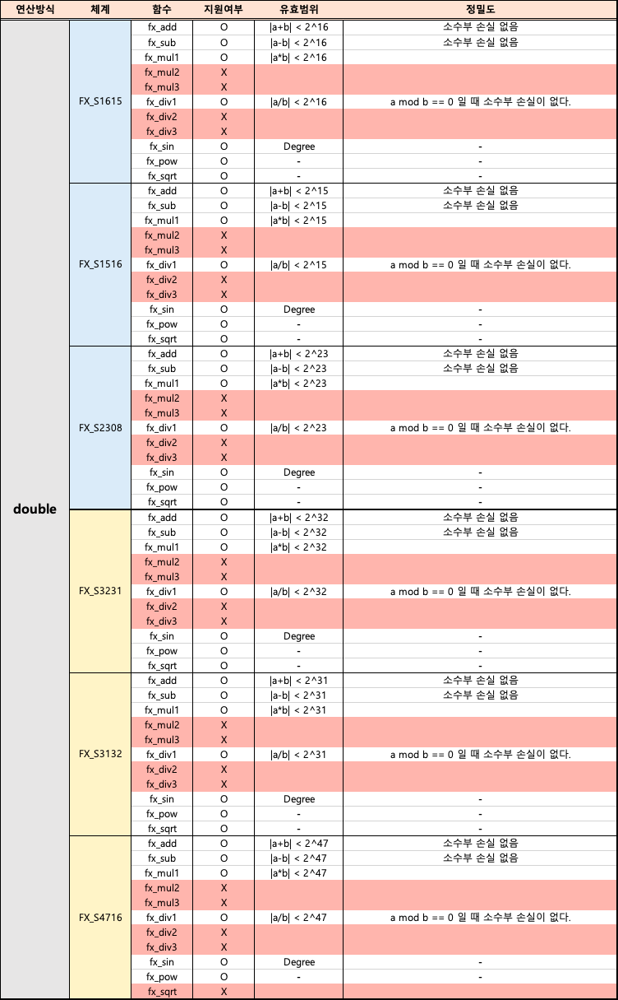
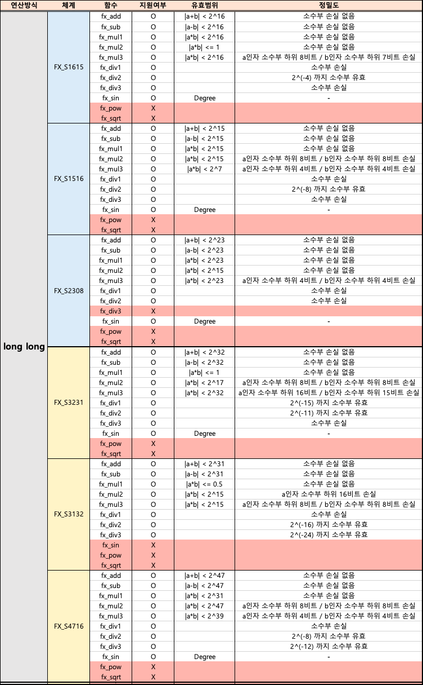

# ajou_fx_team1
아주대학교 2020년 여름방학 실전코딩2 고정 소수점 연산 통합 라이브러리
## 팀원

| 이름 | 학번 | 
| ---- | ---- |
| 고예준 | 201820742 | 
| 김지원 | 201720771 | 
| 조시호 | 201520659 | 
| 최형택 | 201620989 | 


<br>

## 목차

- [1. Functions](#1-functions)
  * [1-1. FX System](#1-1-fx-system)
  * [1-2. FX Calculation Type](#1-2-fx-calculation-type)
  * [1-3. Functions Provided](#1-3-functions-provided)
- [2. Function-Specific Comparison](#2-function-specific-comparison)
  * [2-1. Available Functions per Type & Valid Range](#2-1-available-functions-per-type---valid-range)
- [3. Execution Method](#3-execution-method)

<br>


## 1. Functions

### 1-1. FX System


```
#define _FX_S1615 1
#define _FX_S1516 2

#define _FX_S3231 3
#define _FX_S3132 4

#define _FX_S4716 5 
#define _FX_S2308 6
```

<br>
<br>
<br>

### 1-2. FX Calculation Type
 

```
#define _FX_DOUBLE 1
#define _FX_LONGLONG 2
```

<br>
<br>
<br>


### 1-3. Functions Provided


| 매크로 및 함수 이름 | 기능 |
| ---- | ---- |
| fixed_t double_to_fx(a) | fixed_t 로 표현한 숫자를 double로 형변환한다. |
| double fx_to_double(fa) | double로 표현한 숫자를 fixed_t로 형변환한다. |
| ---- | ---- |
| fixed_t fx_add(fa, fb) | fixed_t로 표현된 두 값을 더해준다.  |
| fixed_t fx_sub(fa, fb) | fixed_t로 표현된 두 값을 빼준다. |
| fixed_t fx_mul1(fa, fb) | fixed_t로 표현된 두 값을 곱해준다. |
| fixed_t fx_div1(fa, fb) | fixed_t로 표현된 두 값을 나눠준다. |
| ---- | ---- |
| [double인 경우 제공되는 함수] | |
| fixed_t fx_sin(fa) | fixed_t로 표현된 각도값(deg)의 sine 을 구해준다.  | 
| fixed_t fx_pow(fa, fb) | fixed_t로 표현된 값의 n승을 구해준다. |
| fixed_t fx_sqrt(fa) | fixed_t로 표현된 값의 제곱근을 구해준다. |
| ---- | ---- |
| [long long 인 경우 제공되는 함수] |  |
| fixed_t fx_mul2(fa, fb)| fixed_t로 표현된 두 값을 곱해준다. |
| fixed_t fx_mul3(fa, fb)| fixed_t로 표현된 두 값을 곱해준다. |
| fixed_t fx_div2(fa, fb) | fixed_t로 표현된 두 값을 나눠준다. | 
| fixed_t fx_div3(fa, fb) | fixed_t로 표현된 두 값을 나눠준다. |
<br>


## 2. Function-Specific Comparison

### 2-1. Available Functions per Type & Valid Range





<br>
<br>

## 3. Execution Method


- 다음과 같은 순서로 빌드 후 실행 결과를 확인한다.     
        1. Build: `make FX_CALCULATION_TYPE=# FX_SYSTEM=#`. (사용자는 목적에 따라 `make FX_CALCULATION_TYPE=1 FX_SYSTEM=2`와 같이 `#`의 위치에 적절한 자연수 값을 입력해야 한다)    
        2. Run: `./ajou_fx` or './ajou_fx.exe'


    - 조건부 컴파일을 이용하여 macro의 정의에 따라 다른 연산이 수행되도록 코드를 구성하였다.
        ```
        [정의된 macro]
        1. _FX_CALCULATION_TYPE
            (1) _FX_DOUBLE
                [input]
                숫자 2개를 입력한다. (a,b)

                [output]
                fa와 fb의 더하기 연산 실행 결과
                fa와 fb의 뺴기 연산 실행 결과
                fa와 fb의 곱하기 연산 실행 결과
                fa에서 fb 나누는 연산 실행 결과

                fa의 sine 연산 실행 결과
                (fa^(fb)) power 연산 실행 결과
                fa의 sqrt 연산 실행 결과

            (2) _FX_LONGLONG
                [input]
                숫자 2개를 입력한다. (a,b)

                [output]
                fa와 fb의 더하기 연산 실행 결과
                fa와 fb의 뺴기 연산 실행 결과
                fa와 fb의 곱하기 연산 실행 결과
                fa에서 fb 나누는 연산 실행 결과

                sine 실행 결과

                fa와 fb의 곱하기 함수2 실행 결과
                fa와 fb의 나누기 함수2 실행 결과
                fa와 fb의 곱하기 함수3 실행 결과
                fa와 fb의 나누기 함수3 실행 결과


        
        2. _FX_SYSTEM
            (1) _FX_S1615 : fixed_t가 fx_s1615로 정의된 경우의 연산 수행
            (2) _FX_S1516 : fixed_t가 fx_s1516로 정의된 경우의 연산 수행
            (3) _FX_S2308 : fixed_t가 fx_s2308로 정의된 경우의 연산 수행
            (4) _FX_S3231 : fixed_t가 fx_s3231로 정의된 경우의 연산 수행
            (5) _FX_S3132 : fixed_t가 fx_s3132로 정의된 경우의 연산 수행
            (6) _FX_S4716 : fixed_t가 fx_s4716로 정의된 경우의 연산 수행
            
        ```
