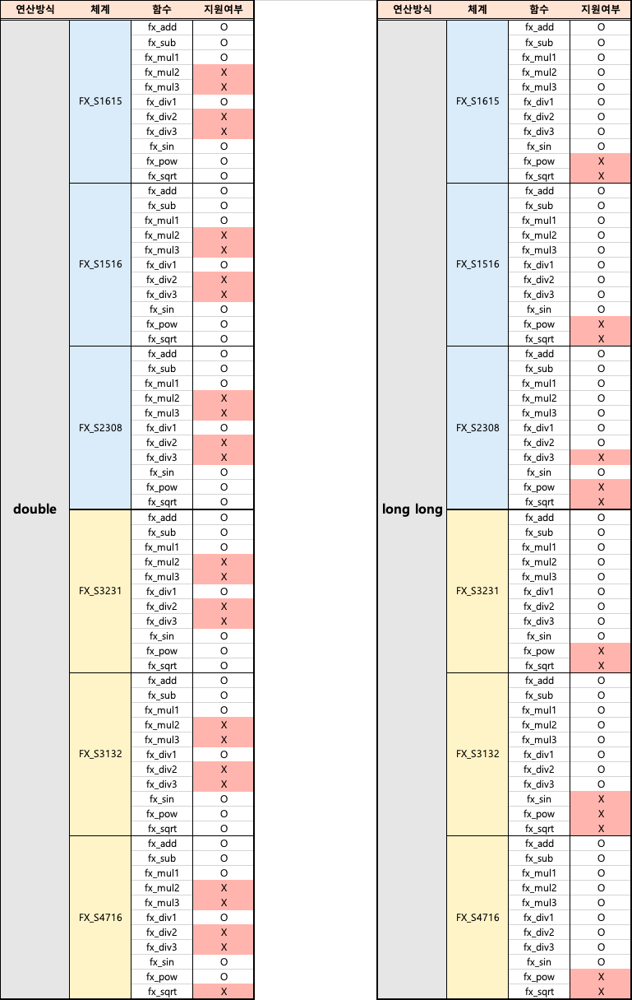

# ajou_fx_team1
아주대학교 2020년 여름방학 실전코딩2 고정 소수점 연산 통합 라이브러리

## 팀원

| 이름 | 학번 | 
| ---- | ---- |
| 고예준 | 201820742 | 
| 김지원 | 201720771 | 
| 조시호 | 201520659 | 
| 최형택 | 201620989 | 


<br>

## 목차

- [1. functions](#1-functions)
  * [1-1. FX SYSTEM](#1-1-fx-system)
  * [1-2. FX CALCULATION TYPE](#1-2-fx-calculation-type)
  * [1-3. FX CALCULATION TYPE optional input and output](#1-3-fx-calculation-type-optional-input-and-output)
  * [1-4. FX CALCULATION TYPE optional functions](#1-4-fx-calculation-type-optional-functions)
- [2. function-specific comparison](#2-function-specific-comparison)
  * [2-1. available functions for each type](#2-1-available-functions-for-each-type)
  * [2-2. effective range](#2-2-effective-range)
- [3. execution method](#3-execution-method)


<br>


## 1. functions

### 1-1. FX SYSTEM


```
#define _FX_S1615 1
#define _FX_S1516 2

#define _FX_S3231 3
#define _FX_S3132 4

#define _FX_S4716 5 
#define _FX_S2308 6
```

<br>
<br>
<br>

### 1-2. FX CALCULATION TYPE
 

```
#define _FX_DOUBLE 1
#define _FX_LONGLONG 2
```

<br>
<br>
<br>

### 1-3. FX CALCULATION TYPE optional input and output

1. double 인 경우


```
[입력]
숫자 2개를 입력한다. (a,b)

[출력 결과]

fa와 fb의 더하기 연산 실행 결과
fa와 fb의 뺴기 연산 실행 결과
fa와 fb의 곱하기 연산 실행 결과
fa에서 fb 나누는 연산 실행 결과

fa의 sine 연산 실행 결과
(fa^(fb)) power 연산 실행 결과
fa의 sqrt 연산 실행 결과

<fa, fb는 a와 b를 각각 fixed_t로 형변환한 숫자>
```

<br>
<br>

2. long long 인 경우

```
[입력]
숫자 2개를 입력한다. (a,b)


[출력 결과]

fa와 fb의 더하기 연산 실행 결과
fa와 fb의 뺴기 연산 실행 결과
fa와 fb의 곱하기 연산 실행 결과
fa에서 fb 나누는 연산 실행 결과

sine 실행 결과

fa와 fb의 곱하기 함수2 실행 결과
fa와 fb의 나누기 함수2 실행 결과
fa와 fb의 곱하기 함수3 실행 결과
fa와 fb의 나누기 함수3 실행 결과

<fa, fb는 a와 b를 각각 fixed_t로 형변환한 숫자>

```

<br>
<br>
<br>


### 1-4. FX CALCULATION TYPE optional functions


| 매크로 및 함수 이름 | 기능 |
| ---- | ---- |
| fixed_t double_to_fx(a) | fixed_t 로 표현한 숫자를 double로 형변환한다. |
| double fx_to_double(fa) | double로 표현한 숫자를 fixed_t로 형변환한다. |
| ---- | ---- |
| fixed_t fx_add(fa, fb) | fixed_t로 표현된 두 값을 더해준다.  |
| fixed_t fx_sub(fa, fb) | fixed_t로 표현된 두 값을 빼준다. |
| fixed_t fx_mul1(fa, fb) | fixed_t로 표현된 두 값을 곱해준다. |
| fixed_t fx_div1(fa, fb) | fixed_t로 표현된 두 값을 나눠준다. |
| ---- | ---- |
| [double인 경우 제공되는 함수] | |
| fixed_t fx_sin(fa) | fixed_t로 표현된 값의 sine 을 구해준다.  | 
| fixed_t fx_pow(fa, fb) | fixed_t로 표현된 값의 n승을 구해준다. |
| fixed_t fx_sqrt(fa) | fixed_t로 표현된 값의 제곱근을 구해준다. |
| ---- | ---- |
| [long long 인 경우 제공되는 함수] |  |
| fixed_t fx_mul2(fa, fb)| fixed_t로 표현된 두 값을 곱해준다. |
| fixed_t fx_mul3(fa, fb)| fixed_t로 표현된 두 값을 곱해준다. |
| fixed_t fx_div2(fa, fb) | fixed_t로 표현된 두 값을 나눠준다. | 
| fixed_t fx_div3(fa, fb) | fixed_t로 표현된 두 값을 나눠준다. |

<br>
<br>
<br>


## 2. function-specific comparison

### 2-1. available functions for each type 




<br>
<br>

### 2-2. effective range

(유효범위 넣기)


<br>
<br>
<br>

## 3. execution method


(수정 필요!!!!!->제맘대로 썼어요 ㅜ_ㅜ 정확히 메크로 어떻게 지정하는지 잘 모르겠어용..!)

- 다음과 같은 순서로 빌드 후 실행 결과를 확인한다.
        1. ``make DEFINE=D[macro] ``
        2. ``./ajou_fx``


    - 조건부 컴파일을 이용하여 macro의 정의에 따라 다른 연산이 수행되도록 코드를 구성하였다.
        ```
        [ifdef로 정의된 macro]
        (1) MULTIPLE_TIME_TEST : 곱셈을 수행하는 경우, double vs long long 시간 테스트
        (2) DIVISION_TIME_TEST : 나눗셈을 수행하는 경우, double vs long long 시간 테스트
        (3) SIN_PRECISION_TEST : sine table이 알맞은지 확인하기 위해 시험해주는 테스트
        (4) FX_MUL_TEST : scanf로 두개의 숫자를 받았을 때, 정의된 4가지 함수로 곱셈을 수행해주는 테스트
        -->FX_S1615_MUL(a, b), FX_1615_LONGLONG_MUL1(a, b),FX_1615_LONGLONG_MUL2(a, b),FX_1615_LONGLONG_MUL3(a, b)
        (5) FX_DIV_TEST : scanf로 두개의 숫자를 받았을 때, 정의된 4가지 함수로 나눗셈을 수행해주는 테스트
        -->FX_S1615_DIV(a, b), FX_1615_LONGLONG_DIV01(a,b),FX_1615_LONGLONG_DIV02(a,b),FX_1615_LONGLONG_DIV03(a,b)
        ```
